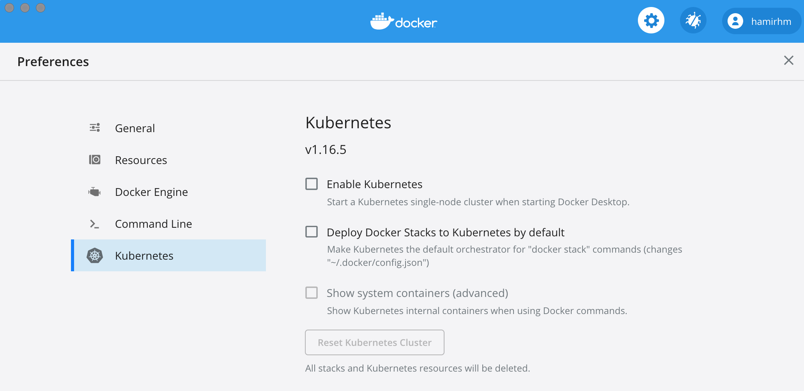
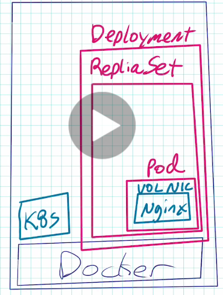

Kubernetes
============

# Installation:
enable it via docker Desktop or in linux host use microk8s (easiest way for linux, it installs using snap)
if installed via microk8s, then kubectl will be microk8s.kubectl (set an alias)

to resolve service dns names enable the coredns by:
`microk8s.enable dns`


In Browser just to play and try:
1. https://play-with-k8s.com
2. http://katacoda.com

using docker desktop, it both enables the kubernetes and as well installs the kubectl (easiest approach)



# CLI
````
kubectl version
````
to see if the kubectl is running , we should see both sever and client verison running

````
kubectl run my-nginx --image nginx
````
similar to docker run, creates and deploys the pods

if now we run the command to see all the pods we see the one pod which has been created: (similarly we can run `kubenctl get all`)
````
kubectl get pods
NAME                  READY   STATUS              RESTARTS   AGE
my-759d54ff4c-z9494   0/1     ContainerCreating   0          10s
````

with option `-w` is similar to usignt he watch commands.



+ Pod: can run one or more containers inside the pod (we could create volumes for the pod)
+ Deployements: to manage the replicaset 
+ ReplicaSet: To ensure the number of pods that we want to run and manage them 

similar to swarm service replicas we could as well update the replicasets (default was one)

to clean and remove we can use the delete deployements command to remove the whole deployement and everything inside (replicaset , pods)
````
kubectl delete deployement my
````
run the get all should see everything removed 

## Scaling replicaset
```` bash
kubectl scale deploy/my --replicas 2
or 
kubectl scale deployement my --replicas 2
````
deploy == deployements = deployement


## logs 

kubectl logs deploy/my --follow

or to see from all that share the same label 

kubectl logs -l run=my

## describe
```
kubctl describe pod/name-of-of
```
silmilar to inspect in docker 

similarly if any lower level objects are removed , the kubernetes tries to recreate them (like swarm or any orchesteration ). like if you delete pods (without removing the deployement it recreate them )


# Services and exposing ports

service is stable address for pod, if we wan to connect to pods then we need to create services. (it is not automatic)

**CoreDNS** allows to resolve the services by name 

````
kubectl expose
````

## Basic Services Types:

+ ClusterIP (default) 
    * Single, internal IP , only reachable within cluster

+ NodePort
    + outside cluster to talk to the cluster
    + High port allocated on each node


## ClusterIP

````
kubectl expose deployement/name-of-deployement --port 
````
by this we could create the service clusterIP for that specific pod which could be resolved by host (if linux). Or we could as well create another deployemnt and could resolve the address from there. host name is the deployement name.

## NodePort
```
kubectl expose deploy/myapp --port 8888 --name ntp --type NodePort
```

````
kubectl get services       
NAME         TYPE        CLUSTER-IP       EXTERNAL-IP   PORT(S)          AGE
kubernetes   ClusterIP   10.96.0.1        <none>        443/TCP          111m
myapp        ClusterIP   10.108.119.110   <none>        8080/TCP         7m16s
np           NodePort    10.101.175.183   <none>        80:32207/TCP     4m20s
ntp          NodePort    10.104.65.2      <none>        8888:32493/TCP   3m44s
````

## NodePort
silimar to Nodeport here we set the type to be `LoadBalancer`
usally this is used when used with external could services. and their API shoud be check to see how to use, however in Desktop version if we use the type loadbalancer it will publich the port directly and could be resolve by host 

```
NAME         TYPE           CLUSTER-IP       EXTERNAL-IP   PORT(S)          AGE
kubernetes   ClusterIP      10.96.0.1        <none>        443/TCP          118m
lb           LoadBalancer   10.103.41.26     localhost     80:31641/TCP     5s
myapp        ClusterIP      10.108.119.110   <none>        8080/TCP         13m
np           NodePort       10.101.175.183   <none>        80:32207/TCP     10m
```                                                      


# Generators

evry command like run, create and expose they have lots os specifications which are filled by generators to defaults specification. to see these specs we could add `--dry-run -o yaml` which shows the commands which is generated on background

```bash
> kubectl create deploy test --image nginx --dry-run -o yaml
apiVersion: apps/v1
kind: Deployment
metadata:
  creationTimestamp: null
  labels:
    app: test
  name: test
spec:
  replicas: 1
  selector:
    matchLabels:
      app: test
  strategy: {}
  template:
    metadata:
      creationTimestamp: null
      labels:
        app: test
    spec:
      containers:
      - image: nginx
        name: nginx
        resources: {}
status: {}
```
compared to for example if we set just as job (nnot to be restarted , run once)

``` bash
> kubectl create job test --image nginx --dry-run -o yaml
apiVersion: batch/v1
kind: Job
metadata:
  creationTimestamp: null
  name: test
spec:
  template:
    metadata:
      creationTimestamp: null
    spec:
      containers:
      - image: nginx
        name: test
        resources: {}
      restartPolicy: Never
status: {}
```
## future of run commands
In current version run commands are reserved only for runing /creating pods and we should first create deployement and use run just for pods
* `kubectl run test --image nginx --dry-run`
    + creates deployements (with warning)
* `kubectl run test --image nginx --port 80 --dry-run`
    + create deployements (with warning) + service
* `kubectl run test --image nginx --restart OnFailure --dry-run`
    + create job.batch (with warning)
* `kubectl run test --image nginx --restart Never --dry-run`
    + this creates pod (this is gonna be the new normal)
* `kubectl run test --image nginx --schedule "*/1 * * * *" --dry-run`
    + create a cronjob


# Imperative vs declarative

**Imperative** : very detailed and explicitly with commands

examples: `kubectl run`, `kubectl create deploy` ,`kubectl update`

**Declarative**: we dont know the detailed state , we are just interested the results

example: `kubectl apply -f my.yaml`

makes more sense on production

**imperative commands**

`run`, `expose`, `scale` , `edit` , `create deploy`
    
best fro dev/ learning

**imperative objects**

`create -f file.yml` , `replace -f file.yml`, `delete` , ...
good for production in small scale
hard to automate

**declarative objects**

`apply -f file.yml`, `dir\`, `diff`
best for prod , easy to automate
